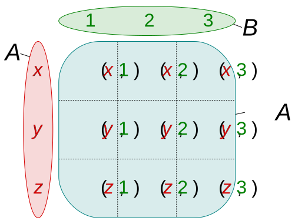
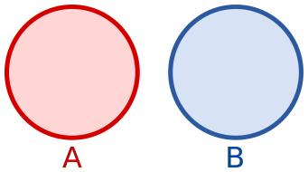
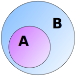

## Algebraic Data Types
Numbers:
```typescript
2 + 2 + 2 =  3 * 2
```

Types:
```typescript
interface User = {
  isLoggedIn: Boolean
  email:      string
}
```

::: notes
Algebra = Lehre von Symbol-Konstellation und Manipulation
:::

## Kinds Of Types
* Product Type*
* Sum Type* 
* Exponential Type*
* Recursive Type
* Linear Type
* Dependent Type
...

*Make illegal state unrepresentable*

## Basic Types 
```typescript 
type String = "" | "a" | "b".. // infty
type Int    = ..-1 | 0 | 1..   // 2^32
..
type Boolean = true | false // 2
type Unit    = unit         // 1
type Void                   // 0
```

::: notes
Notation is mix of Haskell and Typescript
:::

## Product Type
Ideally:
```typescript
type ProductType = Factor x Factor
```

{ width=40% }

<small style="font-size: 9pt">
By Quartl - Own work, CC BY-SA 3.0, https://commons.wikimedia.org/w/index.php?curid=22436861
</small>

## Example 1
```typescript
interface ProductType {
  factor1: Boolean; // 2
  factor2: Boolean; // 2
}
```
```typescript
Boolean x Boolean 
= (true,true) (false,false) (true,false) (false,true)
```

## Example 2
```typescript
interface ProductType {
  factor1: Boolean; // 2
  factor2: Unit;    // 1
}
```
```typescript
Boolean x Unit = (true,unit) (false,unit)    ~ Boolean
```

## Example 3
```typescript
interface ProductType {
  factor1: Boolean; // 2
  factor2: Void;    // 0
}
```
```typescript
Boolean x Void = (true,?)                     ~ Void
```

## Sum Type
Ideally:
```typescript
type SumType = Summand + Summand
<small>also Choice Type, Tagged Union, Discriminated Union
```

{ width=40% }

<small style="font-size: 9pt">
By Stephan Kulla (User:Stephan Kulla) - Own work, CC BY 3.0, https://commons.wikimedia.org/w/index.php?curid=14978640
</small>

## Example 1
```typescript
type SumType = Boolean | Unit 
//     3           2      1
```
```typescript
SumType = true false unit 
```
```typescript
type SumType = BoolTag Boolean | UnitTag Unit 
```

## Example 2
```typescript
type BoolOpt  = Boolean | Unit 
```
```typescript
type BoolOpt  = Boolean | None
```
```typescript
type Option<T> = Some(T) | None
```

## Example 3
```typescript
type SumType = Boolean | Void 
//     2           2      0
```
```typescript
SumType = true false                            ~ Boolean 
```

## Exponential Type
"Ideally:"
```typescript
type ExpoType = Base^Exponent
```

## Example
```typescript
//                   Exponent         Base
type Exponential =    Trilean  =>   Boolean
//     2^3                3             2
//                    t1,t2,t3      true,false
```

## Typescript Choice Types 
CODE EXAMPLE

## Type Alias
```typescript
type Euro = number; 

function toNumber(e: Euro): number {
    return e;
}

function main() {
    toNumber(2); // allowed
}
```

::: notes
can be freely interchanged
:::

## Type Wrapper
```typescript
type Euro =  { value: number };

function toNumber(e: Euro): number {
    return e;
}

function main() {
    toNumber(2); // error
    toNumber( {value: 2} ); // allowed, but overhead
}
```

::: notes
runtime overhead
:::


## Workaround
```typescript
type Euro = number & { readonly __tag: unique symbol };

function toNumber(e: Euro): number {
    return e;
}

toNumber(2); // error
toNumber(2 as Euro); // allowed, no overhead
```
::: notes
source https://kubyshkin.name/posts/newtype-in-typescript/
:::

## TypeWrapper in DDD
```typescript
type RawId       = string 
type ValidatedId = string & { readonly __tag: unique symbol };

function validate(id: RawId): ValidatedId {
  // checks...
  return id as ValidatedId;
}

function fetchUser(id: ValidatedId) {..}

fetchUser("123"); // error
```



## Further Study
:::::::::::::: {.columns}
::: {.column width="40%"}
{ width=90% }
:::
::: {.column width="40%"}
Haskell
Rust

Category Theory

* Product Type
* Sum Type
* Exponential Type
* Functor (map)
* Monad (Optional, Streams, RxJs, flatMap)
:::
::::::::::::::
