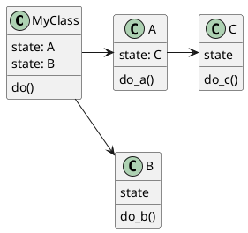

---
author: Malte Neuss
title: Immutability & Pure Functions
# revealjs
# https://github.com/jgm/pandoc-templates/blob/master/default.revealjs
theme: sky
transition: none
slideNumber: true
---

## Reasoning about code

```python
def main()
  prices = [5,2,7]
  # assert prices[0] == 5
```

. . .

```python
  minPrice = minimum(prices)
  # assert  minPrice == 2
```

. . .

```python
  # assert prices[0] == 5?
```

. . .

```python
def minimum(values)
   values.sort()                              # surprise
   return values[0]

```

## Content 

::: incremental

* Immutability
* Pure Functions
* Apply to OO

:::

. . .

> *Easier reasoning, testing, debugging..*

## Immutability

No reassign of variables:

```python
  value = 1                                   # Assign
# value = 2                                   # Reassign
  other = 2
```


. . .

No mutation on objects:

```python
def minimum(values)
   # values.sort()                            # mutation
   other = sorted(values)                     # no mutation
   return other[0]

```

## Benefit: Reasoning

```python
def main()
  prices = immutable([5,2,7])                 # if supported
  # assert prices[0] == 5                     
  minPrice = minimum(prices)
  # assert prices[0] == 5!                    
```

. . .

```python
def minimum(values)
   values.sort()                              # error
   return other[0]

```

## Pure Functions

$$
\begin{align*}
f\colon \mathbb{R} &\to \mathbb{R} \qquad &\text{Type} \\
f(x)    &= x + \pi                  \qquad &\text{Body}
\end{align*}
$$

. . .

```python
def f(x: float) -> float:                     # Type
   return x + math.pi                         # Body
```

::: incremental

* Same input, same output
* No side-effects
* External immutable values or constants ok

:::


## Side-Effect


::: incremental

* File read/write
* Network access
* I/O 
* Throwing exception
* Argument mutation
* ...

:::

. . .

> *Any state change outside of return value*

```python
def f(x: float) -> float
```

## Benefit: Reasoning

```python
def minimum(values)                           # pure
   # values.sort()                             
   other = sorted(values)                     # no mutation
   return other[0]

```

. . .

```python
def main()
  prices = [5,2,7]                            
  # assert prices[0] == 5                     
  minPrice = minimum(prices)                  # pure
  # assert prices[0] == 5!                    
```

## Benefit: Testing

```python
def test()                                    
   values   = [5,2,7]                         # data        
   expected = 2

   out = minimum(values)                       # pure

   assert out == expected 
```

. . .

> *cost(data) < cost(classes)*

## Benefit: Refactoring

Referential transparency:

```python
def main():
  y = compute(5,2) + 7
  z = compute(5,2) + 1
```

. . .

=

```python
def main():
  x = compute(5,2)                            # Factored out
  y = x            + 7
  z = x            + 1
```

. . .

Fearless refactoring, also by compiler 

## Impure Functions

No referential transparency:

```python
def main():                                   # 2 side-effects
  y = randomNumber() + 7                        
  z = randomNumber() + 1                      
```

. . .

!=

```python
def main():                                   # 1 side-effect
  x = randomNumber()                          # Factored out
  y = x              + 7
  z = x              + 1
```

. . .

Careful refactoring, often manual

## Benefit: Abstraction

```python
def f(_: Char) -> Int
```

. . .

```python
def toAscii(c: Char) -> Int
```

. . .

```python
def f(_: [Any]) -> Int
```

. . .

```python
def length(list: [Any]) -> Int
```

Types often enough for understanding.

## Impure Functions

```python
def f() -> None
```

. . .

```python
def performTask() -> None
  inputs = loadInputs()
  computeResult(inputs)
```

. . .

```python
def launchMissiles() -> None
  coord = loadCoordinates()
  ...
```

Need to look at body to be sure.

## Classical OO

```python
class MyClass
  state: LotsOfState                          # private
```

. . .

```python
  def do() -> None                            # public
    state.do_a()   
    state.do_b()  
    this._do()   
```

. . .

```python
  def _do()                                   # private
    state.do_c()
    ...
```

## Classical OO

:::::::::::::: {.columns}
::: {.column width="50%"}

```python
class MyClass
  state: LotsOfState

  def do() -> None
    state.do_a()
    state.do_b()
    this._do()

  def _do()
    state.do_c()
    ...
```

:::
::: {.column width="50%"}



:::
::::::::::::::

. . .

```python
...
myClass.do()
...
```

## FP-ish OO

```python
class MyClass
  constants
```

. . .

```python
  def do(start)                               # Pure 
    x = do_a(start)                           # No mutation
    y = do_b(x, constants)                    # No mutation
    z = this._do(y)                           # No mutation
    return z
```

. . .

```python
  
  def _do(y)                                  # Pure
    return do_c(y, constants)                 # No mutation
```

## Global Mutation

```python
state: LotsOfState                            # Global variable
```

. . .

```python
def someOperation()                                
   state.do_a()                               # Global mutation
```

. . .

```python
def main()                                
   ...
   someOperation()                             
   ...
```

## Class Mutation

```python
class MyClass
  state: LotsOfState                          # Class variable
```

. . .

```python
  def someOperation()                                
    state.do_a()                              # Class mutation
```

. . .

```python
def main()                                
   ...
   myClass.someOperation()                             
   ...
```

## Output arguments

Not ok:

```python
def do(state):                 
  # ... modify argument 'state'
```

. . .

```python
x = do(state)                                 # 'state' mutated
```

. . .

So why should this?

```python
x = state.do()                                # 'state' mutated
```

. . .

```python
class State:

    def do(self):                             # 'self' is 'state'
      # ... modify argument self
```

## How to Side-Effects

```python
def performTask()                 
  inputs = fetchInputs()                      # IO
  result = 2*inputs                            
  publish(result)                             # IO
```

. . .

```python
# Infrastructure/Application layer            # Impure
def performTask()                 
  inputs = fetchInputs()                      
  result = domainLogic(inputs)                
  publish(result)                            

# Domain layer
def domainLogic(inputs)                       # Pure
  return 2*inputs
  
```

> *Separate IO and logic*


## Further Topics

:::::::::::::: {.columns}
::: {.column width="50%"}

Try 

* Scala
* Rust
* Haskell

:::
::: {.column width="50%"}

<small>
Category Theory
</small>

{ width=40% }

* Algebraic Data Types
* Functor (map)
* Monad (flatMap)
* Lens ...

:::
::::::::::::::

::: notes
Image is public domain
:::

## Questions?

Thanks


## Type Checker Support

> *Make illegal state (more) unrepresentable*

## Immutable Built-in Classes

Immutable interface:

```python
mySet = frozenset([1, 2, 3])                  # Python
mySet.add(4)                                  # type error
```

. . .

Copy on change:

```scala
val myList = immutable.List(1, 2, 3)          // Scala
val other  = myList.appended(4)               // other list
```


## Immutable Custom Classes

Immutable interface around mutable data:

```python
class MyClass:                                
   _value: int                                # hide mutables
   
   def getValue()                             # no setters
     return _value
   
   def calcSth()                              # _value read only
     return _value*2
   
   def incremented()                          # Copy on change
     return MyClass(_value+1)
```

## Immutable Custom Classes

With extra language support:

```python
@dataclass(frozen=True)                       # Python
class MyClass:
   value: int
   
object       = MyClass(1)
object.value = 2                              # compile error!
```

. . .

```typescript
interface MyInterface {                       // Typescript
  readonly value: int;
}
```

## Immutable Variables

Mutable:

```typescript
var value = 1                                 // Typescript
value = 2                                     // ok
```

. . .

Immutable:

```typescript
const value = 1                               // Typescript
value = 2                                     // type error!
```
